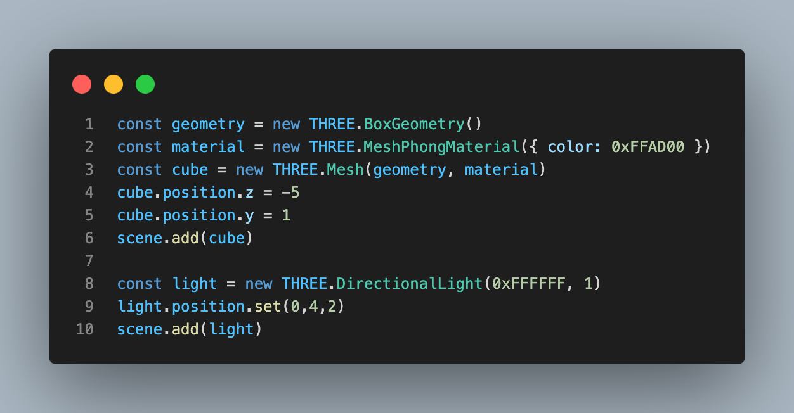

Installation:

1. creating a vite development server
    - npm init vite
    - then choose whatever environment you want

2. install threejs
    - npm install three
    - npm install --save @types/three (for ts)

Setting up threeJS:
1. add canvas tag to main html page
    - <canvas id="bg"></canvas>
2. import threejs library in main index.tsx page
    - import * as THREE from 'three'

* Note for three: 
    - When starting with threeJs you will always need three objects
    1. Scene
    2. Camera
    3. Renderer

3. Scene: a container that holds all your objects objects, cameras and lights. 
    - Basically where you are displaying everything, your shapes, lights, etc

4. Camera: basically the persepctive of what human eyes can see
    - takes in a few arguments:
    1. field of view (based off 360 degrees)
    2. aspect ratio off user's browser winder
    3. view furstum: controls which objects are visible relative to the camera itself
    - Basically decides what objects on the scene is showed on the renderer

5. Renderer: Takes what the camera and scene and draws whatever the camera can see

* Refer to the threeJS starter Image 

Adding Things:

    Cube:
    1. add the geometry
    2. add material
    3. create the cub with the positions
    4. add the cube to the scene
    5. create the light
    6. add the light

